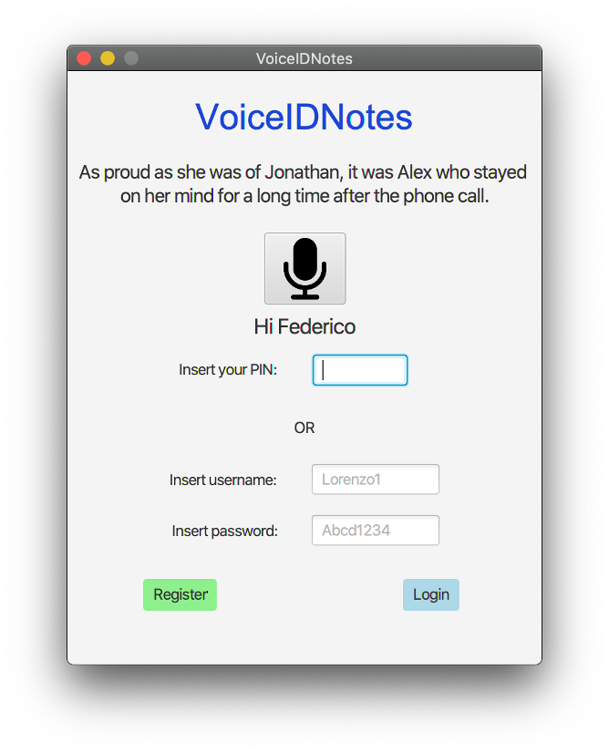

# VoiceIDNotes

VoiceIDNotes is a simple note-taking application focused on keeping users’ notes private. The users can access their notes only after performing the login, 
either letting the app use a model to identify their voice or using their username and password.

The key idea is that everyone has their own particular and personal voice. VoiceIDNotes allows users to have an easy login phase because once recognized their 
voices a simple 4-digit pin will be required.

In order to recognize the user's voice the application automatically extract audio features of a user's voice and classify/recognise the user.

[Here](requirements.pdf) are present the requirements of the project.

The complete documentation is available [here1](documentation.pdf); there is also a presentation of the project [here2](documentation.pdf).

(Repository for data mining and machine learning's project)

## Goals are:
- To perform an analysis using the cross-validation methodology classifiers of the model (classifiers and attribute selection algorithms)
- To preform all stages of KDD (data pre-processing, attribute selection, model learning and validation)
- To develop an application which embeds a machine learning algorithms

## Project structure
 - `VoiceIDNotesApp`: the Java(17) application module
 - `VoiceIDNotesFeaturesExtractor`: the Python(3.8) server module that receive a voice audio ('.wav' format) and extract its features (before running the module check versions of the used libraries [here](VoiceIDNotesFeaturesExtractor/libraries.txt))

## Preview

   

